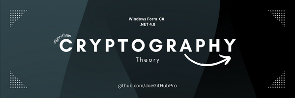
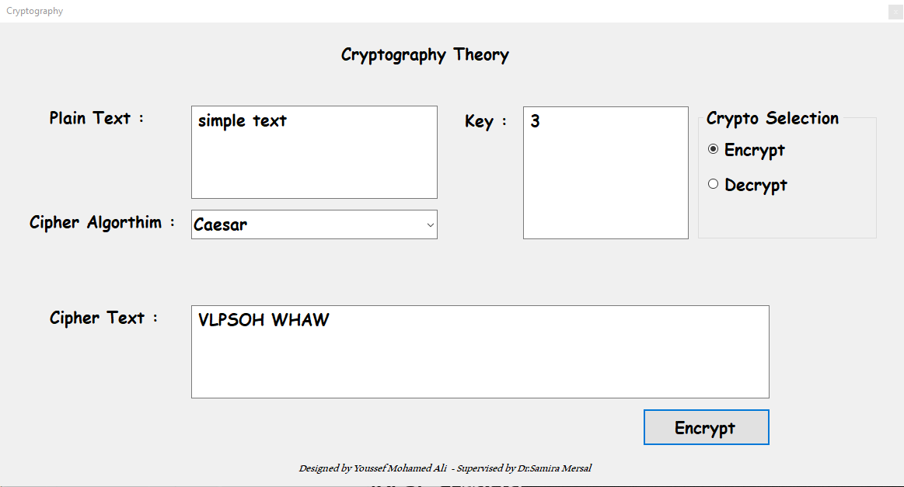

    

<body>
  <h1>Cryptography Algorithms Desktop Application</h1>
  
This is educational project for Cryptography theory

  <h2>Features</h2>
  <ul>
    <li><strong>Algorithm Support:</strong> The application supports multiple cryptography algorithms, including symmetric and asymmetric encryption algorithms, hash functions, and digital signatures.</li>
    <li><strong>User-Friendly Interface:</strong> The application provides an intuitive and user-friendly interface for easy interaction and operation.</li>
    <li><strong>Encryption and Decryption:</strong> Users can encrypt their sensitive data using different algorithms and decrypt it back to its original form when needed.</li>

  </ul>
  <h2>Implemented Algorithms</h2>
  <ul>
    <li>Caesar : A substitution cipher where each letter in the plaintext is shifted a certain number of places down or up the alphabet.</li>
    <li>Columnar Transposition: A transposition cipher where the plaintext is rearranged according to a matrix of a fixed column width.</li>
    <li>Hill: A polygraphic substitution cipher based on linear algebra, using matrices to encrypt and decrypt plaintext.</li>
    <li>Monoalphabetic: A substitution cipher where each letter in the plaintext is consistently replaced by another letter from a fixed mapping.</li>
    <li>Playfair: A digraph substitution cipher that encrypts pairs of letters together based on a 5x5 grid of letters generated from a keyword.</li>
    <li>Rail Fence: A transposition cipher where the plaintext is written diagonally in zigzag fashion across a number of "rails" and then read off row by row.</li>
    <li>Vernam (One-Time Pad): An encryption method that uses a random key as long as the message itself, XORing each plaintext character with a corresponding key character.</li>
    <li>Vigenère: A polyalphabetic substitution cipher where each letter in the plaintext is shifted using a keyword, with each letter of the keyword determining the shift for the corresponding letter in the plaintext.</li>

  </ul>

  <h2>Installation</h2>
  <ol>
    <li>Clone the repository:</li>
  </ol>
  <pre><code>git clone https://github.com/JoeGitHubPro/Cryptography.git</code></pre>
  <ol start="2">
    <li>Install the required dependencies. [Provide instructions here if there are any specific dependencies or setup steps.]</li>
    <li>Build and run the application using your preferred development environment or IDE.</li>
  </ol>

  <h2>Usage</h2>
  

    

  <h2>Contributing</h2>
  
Contributions are welcome! If you'd like to contribute to this project, please follow these steps:

  <ol>
    <li>Fork the repository.</li>
    <li>Create a new branch for your feature or bug fix.</li>
    <li>Make your changes and commit them.</li>
    <li>Push your changes to your forked repository.</li>
    <li>Submit a pull request detailing your changes.</li>
  </ol>

  <h2>License</h2>
  
This project is licensed under the MIT

  <h2>Contact</h2>
  
If you have any questions or suggestions, feel free to reach out to the project owner:

  <ul>
    <li>GitHub: <a href="https://github.com/JoeGitHubPro">JoeGitHubPro</a></li>
  </ul>

  <h2>Acknowledgments</h2>
  
WinForm, C#, DS&A

</body>
</html>
